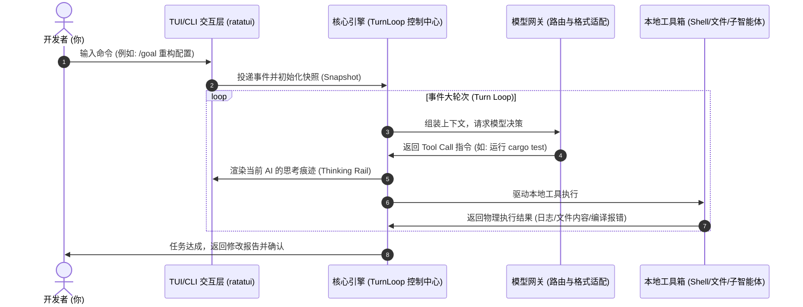

# mimofan 中文架构与使用指南 🚀 (说人话版)

欢迎阅读 mimofan 的中文集成文档！本文抛弃了假大空的专业黑话，致力于以**大白话**把本系统的底层架构和二次开发技巧为您彻底说清楚。

---

## 1. 用人话讲清 mimofan 到底是个啥？

简单来说，**mimofan 就是一个帮你在终端里自动读代码、改代码、跑编译、解 Bug 的 AI 机器人**。
它不是一个简单的对话框，它是一个**具备闭环执行能力（AI Agent）的工具箱**。你给它提一个目标（比如 `帮我重构这个模块并确保测试通过`），它会自己在后台开一个事件循环：
1. 问大模型：`第一步我该干啥？`
2. 大模型说：`先读一下 XX 文件`。
3. 它自动去读这个文件，把内容发回给大模型。
4. 大模型说：`把第 20 行改成这样，然后运行 cargo test`。
5. 它自动修改文件，并在你的终端里静默运行 `cargo test`。
6. 测试报错了，它把报错日志抓取下来再喂给大模型。
7. 大模型分析报错，修正代码，直到测试完全跑通。

这一切都是**全自动**的，直到它最终帮你把问题解决。

---

## 2. 核心架构分层图

以下是 mimofan 运行时的核心事件流向和分层情况：



---

## 3. 依赖的核心三方 Rust 组件 (我们在用什么？)

mimofan 之所以能够保持极高的运行速度和稳定性，得益于 Rust 生态中这几个核心三方组件：

| 三方组件 | 本系统中的主要职责 (说人话职责) |
| :--- | :--- |
| **`ratatui`** | **绘制终端界面**。整个精美的 TUI 像素、输入框、进度条、动态面板都是用它一行行画出来的。 |
| **`tokio`** | **异步动力心脏**。负责多线程调度、子智能体并发执行、以及网络 I/O 监听，确保界面不卡顿。 |
| **`reqwest`** | **网络客户端**。负责与 DeepSeek、Anthropic 等各大云端模型提供商进行超高速的 API 对话请求。 |
| **`serde` & `serde_json`** | **数据序列化/反序列化**。解析你的配置文件 `settings.json`，把大模型返回的 Tool Call 字符串转为 Rust 强类型结构体。 |
| **`rusqlite`** | **本地数据库**。在 `crates/state` 里面用来持久化存储会话历史、任务快照、Token 消耗统计等，重启系统不会丢失上下文。 |

---

## 4. 提示词工程 (Prompt Engineering) 说明

mimofan 是如何让模型老老实实听话，只干活而不失控的？

*   **核心 System Prompt 位置**：
    系统的终极 System Prompt 模板保存在 [crates/tui/src/prompts.rs](file:///Users/a0000/mywork/commonLLM/opensource/nnnew/agent-CodeWhale/crates/tui/src/prompts.rs) 中。
*   **引导与限制设计**：
    *   **Tool-Use 强引导**：Prompt 里使用了严格的 XML 标签格式（如 `<call:default_api:run_command>`），强迫大模型在想要执行命令或改文件时输出标准 XML，而不是吐一堆废话。
    *   **权限防御线**：提示词明文告诫大模型，任何写操作、Shell 命令都必须符合本地的策略文件（`permissions.toml`），用户如果不允许，命令就会被系统拦截，防范 AI 恶意擦除磁盘。
    *   **反忽悠机制**：系统提示词在引导大模型回答时，强制要求其以客观的、理性的“资深软件工程专家”视角切入，不迎合、不输出空洞的赞美，有错误直接指出来。

---

## 5. 核心能力常用方法入口 (代码地图)

如果你想修改或者研究底层的核心功能，请直接查阅以下关键代码文件的相应行数：

*   **转轮控制中心 (Turn Loop 事件大循环)**：
    *   入口文件：[crates/tui/src/core/engine/turn_loop.rs](file:///Users/a0000/mywork/commonLLM/opensource/nnnew/agent-CodeWhale/crates/tui/src/core/engine/turn_loop.rs)
    *   核心范围：`L150 - L450` 详细定义了如何接收大模型发来的 XML 行为，如何拦截命令、以及如何向渲染器派发进度状态。
*   **全局配置与缓存门面**：
    *   配置入口：[crates/tui/src/config.rs](file:///Users/a0000/mywork/commonLLM/opensource/nnnew/agent-CodeWhale/crates/tui/src/config.rs#L2386-L2520) (定义 API Key, Base URL 的动态决策链)。
    *   极速缓存：[crates/tui/src/settings.rs](file:///Users/a0000/mywork/commonLLM/opensource/nnnew/agent-CodeWhale/crates/tui/src/settings.rs#L588-L604) (在 `load` 和 `save` 方法中利用 `SETTINGS_CACHE` 读写锁实现零磁盘 IO 开销的内存拦截)。
*   **命令执行器 (Shell Runner)**：
    *   入口文件：[crates/tui/src/tools/shell.rs](file:///Users/a0000/mywork/commonLLM/opensource/nnnew/agent-CodeWhale/crates/tui/src/tools/shell.rs#L85) (实现标准命令的生成、Pty 伪终端伪装以及退出码获取)。
*   **多语言简体中文翻译字典**：
    *   字词翻译字典：[crates/tui/locales/zh-Hans.json](file:///Users/a0000/mywork/commonLLM/opensource/nnnew/agent-CodeWhale/crates/tui/locales/zh-Hans.json) (这是我们保留的唯一的本地化字典文件，里面包含了所有的界面字面量对照表)。
    *   加载引擎：[crates/tui/src/localization.rs](file:///Users/a0000/mywork/commonLLM/opensource/nnnew/agent-CodeWhale/crates/tui/src/localization.rs#L3234-L3248) (调用 `chinese_simplified` 动态解析该 JSON，无任何冗余的外语 dead code)。

---

## 6. 二次开发常用函数与使用用例

如果你想在 Rust 代码里，以程序化方式去读取系统的当前配置，或者去执行翻译、去写磁盘，可以参考以下真实用例：

### 用例 A：在你的新组件中获取当前生效的全局配置项
```rust
use mimofan::config::Config;

fn log_current_model_info(config: &Config) {
    // 1. 获取当前生效的 API 密钥 (自动解密，且走极速内存缓存)
    if let Ok(api_key) = config.deepseek_api_key() {
        println!("当前 API 密钥为: {}", api_key);
    }
    
    // 2. 获取当前正在使用的大语言模型名称
    let current_model = config.default_model();
    println!("使用模型: {}", current_model);
    
    // 3. 获取 API 基础链接
    let base_url = config.deepseek_base_url();
    println!("模型 Base URL: {}", base_url);
}
```

### 用例 B：在界面渲染中输出经过本地化翻译的简体中文
```rust
use mimofan::localization::{Locale, MessageId, tr};

fn draw_tui_composer_placeholder() {
    // 根据系统当前的区域设置，输出对应的简体中文。
    // 由于我们精简了其他死代码语言，此处只会加载 zh-Hans.json 字典。
    let placeholder_text = tr(Locale::ZhHans, MessageId::ComposerPlaceholder);
    println!("输入框提示语: {}", placeholder_text); // 输出: "写下任务，或者输入 / 呼出命令。"
}
```

### 用例 C：通过内存缓存刷新系统设置并自动同步磁盘
```rust
use mimofan::settings::Settings;

fn change_default_model_to_pro() -> anyhow::Result<()> {
    // 1. 从缓存中拉取最新设置
    let mut current_settings = Settings::load()?;
    
    // 2. 修改默认模型名
    current_settings.default_model = Some("mimo-v2.5-pro".to_string());
    
    // 3. 保存更改。
    // 该方法会自动写入磁盘，并清空全局读写锁 SETTINGS_CACHE，
    // 保证系统的其他并发读取（如各 API Client）能即时获取最新值。
    current_settings.save()?;
    Ok(())
}
```

---

## 7. 简体中文单一 Locale 声明

为节约硬件能耗、降低模型扫描代码库时的 Token 开销、加快编译与链接链接速度，**本项目已彻底移除英语、越南语、日语、繁体中文、西班牙语及葡萄牙语等多语言匹配死代码**。
系统会天然地首选和默认呈现**简体中文**界面。
如果您需要增加对中国其他地方特色或业务定制的中文用语，只需直接编辑修改 [crates/tui/locales/zh-Hans.json](file:///Users/a0000/mywork/commonLLM/opensource/nnnew/agent-CodeWhale/crates/tui/locales/zh-Hans.json) 这个 JSON 文件即可，无需修改任何 Rust 代码逻辑，极其便利！
