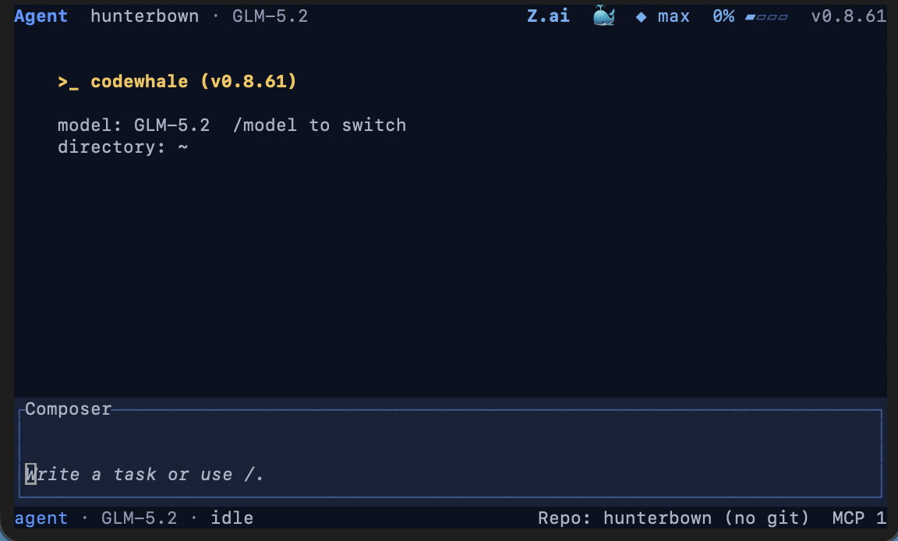

# mimofan

> 为任何模型打造的终端编程助手 — 优先支持开源模型。

mimofan 是一个终端编程助手，同时提供 TUI（终端界面）和 CLI（命令行）两种模式。给它指定一个模型和项目，它就能开始工作：读代码、改代码、跑命令、检查结果、规划多步任务，出错了还能自己修正。

**核心特点：**
- 开源免费（MIT 协议），Rust 编写，运行在你自己的机器上
- 优先支持 DeepSeek 等开源模型，也支持 Claude、GPT、Kimi、GLM 等商业模型
- 支持本地部署的 vLLM/SGLang/Ollama，无需 API Key
- 你选模型和提供商，mimofan 自动解析路由并运行

[中文架构说明](docs/ARCHITECTURE_CN.md) · [中文使用指南](docs/USAGE_CN.md) · [mimofan.net](https://mimofan.net/) · [安装指南](docs/INSTALL.md) · [提供商列表](docs/PROVIDERS.md) · [更新日志](CHANGELOG.md)

[](https://github.com/XiaomingX/mimofan/actions/workflows/ci.yml)
[](https://crates.io/crates/mimofan-cli)
[](https://www.npmjs.com/package/mimofan)



## 快速安装

### npm 安装（推荐）

```bash
npm install -g mimofan
mimofan --version   # 0.8.65
```

npm 包会自动下载对应平台的二进制文件（SHA-256 校验），安装 `mimofan` 和 `codew` 命令。

### 源码编译

需要 Rust 1.88+：

```bash
cargo install mimofan-cli --locked
cargo install mimofan --locked
```

> **Linux 用户**需要先安装系统依赖：
> `sudo apt-get install -y build-essential pkg-config libdbus-1-dev`
> 详见 [安装指南](docs/INSTALL.md)

### 其他安装方式

```bash
# Docker
docker pull ghcr.io/hmbown/mimofan:latest

# Nix
nix run github:XiaomingX/mimofan

# Windows
scoop install mimofan        # 或从 GitHub Releases 下载 NSIS 安装包

# 国内镜像（无法访问 GitHub 时使用）
cargo install --git https://cnb.cool/mimofan.net/mimofan --tag v0.8.65 mimofan-cli --locked --force
cargo install --git https://cnb.cool/mimofan.net/mimofan --tag v0.8.65 mimofan --locked --force

# Homebrew（旧名称兼容）
brew tap Hmbown/deepseek-tui
brew install deepseek-tui
```

所有平台的预编译文件（包括 Linux riscv64）都在 [GitHub Releases](https://github.com/XiaomingX/mimofan/releases)。国内镜像、Windows 细节、常见问题详见 [docs/INSTALL.md](docs/INSTALL.md)。

**从旧版 `deepseek-tui` 升级？** 你的配置、会话、技能和 MCP 设置都会保留。详见 [docs/REBRAND.md](docs/REBRAND.md)，然后运行 `mimofan doctor` 确认。

## 首次使用

```bash
# 1. 设置 API Key
mimofan auth set --provider deepseek

# 2. 检查状态
mimofan auth status

# 3. 运行诊断
mimofan doctor

# 4. 启动
mimofan
```

所有提供商的配置方式都一样：`--provider openrouter`、`--provider moonshot` 等。本地部署的 vLLM/SGLang/Ollama 不需要 Key。Claude 用户运行 `mimofan auth set --provider anthropic` 或设置环境变量 `ANTHROPIC_API_KEY`。

Key 保存在 `~/.mimofan/config.toml`，旧版 `~/.deepseek/` 配置仍可读取。

### 常用命令

| 命令 | 说明 |
|------|------|
| `/provider` | 打开提供商面板，查看认证状态、路由、费用 |
| `/model` | 选择模型和推理强度 |
| `/restore` | 回滚到上一轮的快照 |
| `/fleet` | 打开 Fleet 面板 — 角色、配置、策略 |
| `/skills` | 加载 `~/.mimofan/skills/` 中的可复用工作流 |
| `/config` | 编辑运行时设置 |
| `/statusline` | 显示当前路由、费用、会话状态 |
| `! <命令>` | 执行任意 Shell 命令（如 `! cargo test`） |

### 无头模式（脚本/CI）

```bash
mimofan exec --allowed-tools read_file,exec_shell --max-turns 10 "修复失败的测试"
```

## 提供商与路由

你选择提供商和模型，mimofan 解析出**真实路由** — 具体的端点、协议、模型 ID、上下文限制和价格 — 而不只是换一个 URL。

路由解析后，整个系统可以做到：
- **上下文预算准确** — 压缩阈值和可用窗口来自真实的上下文限制
- **费用显示诚实** — 只显示真实价格，未知模型显示为"未知"而非 $0
- **协议明确** — Chat Completions、Responses API、Anthropic Messages 等协议在路由中明确指定

运行时用 `/provider` 和 `/model` 切换路由。完整列表见 [docs/PROVIDERS.md](docs/PROVIDERS.md)。

### 支持的提供商

所有提供商都通过同一套运行时和工具。如果缺你需要的，欢迎提 Issue。

**开源模型（托管）：**
- `deepseek`（默认）、`openrouter`、`huggingface`
- `moonshot`（Kimi）、`zai`（GLM）、`minimax`、`volcengine`（Ark）
- `nvidia-nim`、`together`、`fireworks`、`novita`
- `siliconflow` / `siliconflow-CN`、`arcee`、`xiaomi-mimo`
- `deepinfra`、`stepfun`、`atlascloud`、`qianfan`、`wanjie-ark`
- 以及任何 OpenAI 兼容的网关（`openai` 提供商）

**开源模型（自托管）：**
- `vllm`、`sglang`、`ollama` — 本地部署，无需 Key

**商业模型（原生支持）：**
- `anthropic` — 专用 `/v1/messages` 适配器，支持自适应思考和缓存断点
- `deepseek-anthropic` — DeepSeek 的 Messages API 路由
- `openai-codex`（实验性）— 复用 ChatGPT/Codex CLI 登录

## Fleet（多任务编排）

Fleet 是 mimofan 的持久化控制平面，用于多任务并行执行。每个任务是一个无头 `mimofan exec` 进程，Fleet 负责启动、追踪和恢复。

```bash
mimofan fleet run tasks.json --max-workers 4
mimofan fleet status
mimofan fleet resume <run-id>
```

`fleet resume` 会重放日志，恢复中断的任务（在预算内重试），幂等安全。每个任务记录结果（`pass` / `fail` / `partial` / `skip` / `timeout`）。

任务通过**角色**、**配置**、**装备**和**槽位**来配置，在 config 的 `[fleet]` 中设置。详见 [docs/FLEET.md](docs/FLEET.md)。

## 安全机制

mimofan 会编辑文件和执行命令，安全是产品核心，不是事后补丁。

- **三种模式** — Plan（只读调查）、Agent（执行时逐个确认）、YOLO（自动批准）。用 `Tab` 或 `/mode` 切换。
- **工具审批** — `.mimofan/hooks.toml` 可以对任何工具调用设置允许/拒绝/询问。
- **系统沙箱** — macOS 用 Seatbelt，Linux 用 Landlock + seccomp，还支持 bubblewrap。
- **回滚** — 快照存在 `.git` 之外，`/restore` 可以撤销操作而不影响真实 Git 历史。

## 功能特性

- **持久化目标循环** — 用 `/goal` 设置目标，Agent 会跨轮次持续工作（读、改、跑、检查），直到完成、阻塞或你手动停止。无轮次上限。
- **持久化会话** — 跨重启和系统休眠，一个需要 40 次工具调用的任务能撑到第 41 次。
- **无头模式** — `mimofan exec` 支持 `--allowed-tools`、`--disallowed-tools`、`--max-turns`、`--append-system-prompt`。
- **MCP 双向集成** — 既可消费外部 MCP 服务器的工具，也可通过 `mimofan mcp` 把自己暴露为 MCP 服务器。
- **技能系统** — `~/.mimofan/skills/` 中的可复用工作流，用 `/skills` 加载。
- **多端嵌入** — HTTP/SSE 和 ACP 运行时 API、VS Code 扩展、飞书/Telegram 桥接（微信实验中）。

## 指令优先级

随着项目演进，指令会越来越多且互相冲突：原始需求、后来的重构、旧记忆、之前的交接、你当前的请求、新的测试结果。普通系统提示让模型靠猜来解决冲突。mimofan 使用**嵌套宪法**，明确优先级：

1. **全局宪法** — 基础法则，编译进每个二进制文件
2. **项目法则** — 在 `.mimofan/constitution.json` 中声明 `protected_invariants`、`branch_policy` 等
3. **当前请求** — 本轮的操作指令
4. **实时证据** — 工具返回的实际结果（模型不能报告不存在的事实）

当指令冲突时，高优先级的胜出。因为法则在框架中而非模型中，换模型也能保持结构一致。

## 文档索引

- [用户指南](docs/GUIDE.md) · [安装指南](docs/INSTALL.md) · [配置说明](docs/CONFIGURATION.md) · [提供商列表](docs/PROVIDERS.md)
- [模式说明](docs/MODES.md) — Agent、Plan、YOLO
- [Fleet](docs/FLEET.md) · [子代理](docs/SUBAGENTS.md) — 角色、生命周期、输出契约
- [架构文档](docs/ARCHITECTURE_CN.md) — crate 布局、运行时流程、工具系统、安全模型
- [WhaleFlow](docs/WHALEFLOW_AUTHORING.md) · [MCP](docs/MCP.md) · [运行时 API](docs/RUNTIME_API.md)
- [快捷键](docs/KEYBINDINGS.md) · [沙箱与审批](docs/SANDBOX.md) · [Docker](docs/DOCKER.md) · [记忆系统](docs/MEMORY.md)
- [完整文档索引](docs)

## 参与贡献

mimofan 最初是个人的 DeepSeek 项目，现在是全球开发者共同打造的开源项目。

**所有反馈都是礼物。** Issue、PR、Bug 报录、功能建议、"第一个 PR"、好奇的问题 — 都是真正的项目贡献。维护者会认真对待每个报告，即使最终补丁需要调整或合并到维护者提交中 — 贡献者都会在公开记录中保留署名。

- [提交 Issue](https://github.com/XiaomingX/mimofan/issues) — 好的入门贡献在这里
- [贡献指南](CONTRIBUTING.md) — 搭建开发环境并提交 PR
- [行为准则](CODE_OF_CONDUCT.md) — 互相尊重
- [贡献者列表](docs/CONTRIBUTORS.md) — 塑造 mimofan 的人们

支持项目：[Buy me a coffee](https://www.buymeacoffee.com/hmbown)

## 致谢

mimofan 因为使用它、破坏它、修复它的人而存在。

- **[DeepSeek](https://github.com/deepseek-ai)** — 感谢提供模型与支持，让项目得以启动。
- **[DataWhale](https://github.com/datawhalechina)** 🐋 — 感谢支持，欢迎加入鲸鱼兄弟大家庭。
- **[OpenWarp](https://github.com/zerx-lab/warp)** 和 **[Open Design](https://github.com/nexu-io/open-design)** — 感谢协作打造更好的终端 Agent 体验。
- **所有贡献者** — 完整的 PR 记录在 [docs/CONTRIBUTORS.md](docs/CONTRIBUTORS.md)。谢谢。

## 许可证

[MIT](LICENSE)

> *mimofan 是独立的社区项目，与任何模型提供商无关。*

## Star 趋势

[](https://www.star-history.com/?repos=XiaomingX%2Fmimofan&type=date&logscale=&legend=top-left)
