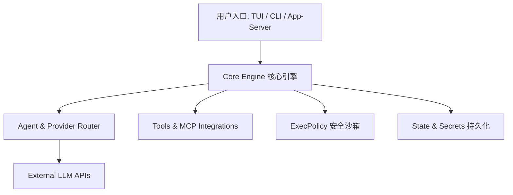

# mimofan 🚀

> **高性能、开源、轻量级的终端 AI 编码助手与智能体运行时**
> 
> 基于 Rust 实现，原生支持 **Xiaomi MiMo** 模型，兼容 DeepSeek、OpenAI、Anthropic 及通用 OpenAI 兼容协议。

[](LICENSE)
[](https://www.rust-lang.org/)
[]()
[](docs/MCP.md)

`mimofan` 专注于为开发者提供高效、智能、安全的命令行 AI 协作体验。只需输入目标任务，`mimofan` 即可自主完成任务拆解、代码检索、文件编辑、工具调用与测试验证。

---

## ✨ 核心特性

- ⚡ **极致性能**：基于 Rust 编写，毫秒级启动，极低内存占用与流畅的 TUI 终端体验。
- 🤖 **原生 MiMo & 多 Provider 路由**：默认针对 **Xiaomi MiMo** 深度优化，同时支持 DeepSeek、OpenAI、Qwen 及各类 OpenAI 兼容 Endpoint。
- 🖥️ **三大灵活使用形态**：
  - **TUI 交互模式**：全功能终端界面，实时查看 Agent 思考链与文件变更。
  - **CLI 命令行模式**：支持一行命令单次调用，易于脚本集成与 CI/CD 自动化。
  - **HTTP/JSON-RPC 服务**：支持作为后台 Server 运行，方便嵌入 IDE 插件或第三方系统。
- 🛡️ **安全策略与沙箱防护**：内置 `execpolicy` 权限控制与工作区写防护（Workspace-write），有效拦截危险命令与越权操作。
- 🔌 **生态扩展支持**：
  - **MCP (Model Context Protocol)**：无缝桥接上下文插件与外部 Server 工具。
  - **多子 Agent 协同**：支持并发衍生专职 Subagent 处理独立子任务。
  - **IM 机器人桥接**：提供飞书 (Feishu) 和微信 (WeChat) 桥接组件。

---

## 📦 快速安装

### 方式一：使用 Node.js 包管理器（推荐）

```bash
# 使用 pnpm 全局安装
pnpm add -g mimofan

# 或使用 npm
npm install -g mimofan
```

### 方式二：使用一键安装脚本

```bash
curl -fsSL https://mimofan.net/install.sh | sh
```

### 方式三：源码编译安装（需要 Rust 1.88+）

```bash
git clone https://github.com/XiaomingX/mimofan.git
cd mimofan
cargo install --path crates/cli --locked
```

---

## ⚡ 快速上手

### 1. 初始化配置文件

```bash
mkdir -p ~/.mimofan
cp config.example.toml ~/.mimofan/config.toml
```

编辑 `~/.mimofan/config.toml` 填入 API Key：

```toml
provider = "xiaomi-mimo"
api_key = "你的_MIMO_API_KEY"
base_url = "https://api.xiaomimimo.com/v1"
default_text_model = "mimo-v2.5-pro"
```

*或者通过环境变量直接配置：*

```bash
export MIMO_API_KEY="你的_MIMO_API_KEY"
export MIMO_BASE_URL="https://api.xiaomimimo.com/v1"
```

### 2. 环境健康检查

运行诊断命令校验网络与 API 鉴权状态：

```bash
mimofan doctor
```

### 3. 启动交互式 TUI

```bash
mimofan
```

---

## ⚙️ 多模型 Provider 配置指南

`mimofan` 内置灵活的 Provider 路由系统，支持快速切换不同模型服务商：

### 1. Xiaomi MiMo (默认推荐)
```toml
provider = "xiaomi-mimo"
api_key = "sk-..."
base_url = "https://api.xiaomimimo.com/v1"
default_text_model = "mimo-v2.5-pro"
```

### 2. DeepSeek
```toml
provider = "deepseek"
api_key = "sk-..."
base_url = "https://api.deepseek.com/v1"
default_text_model = "deepseek-chat"
```

### 3. 通用 OpenAI 兼容接口 (如 Qwen / Local LLM)
```toml
provider = "openai-compatible"
api_key = "sk-..."
base_url = "https://your-custom-endpoint/v1"
default_text_model = "qwen-max"
```

---

## 🖥️ 三大使用形态说明

| 形态 | 启动命令 | 典型适用场景 |
|------|----------|--------------|
| **TUI 交互界面** | `mimofan` | 每日开发协同、复杂代码重构、交互式调试 |
| **CLI 单次调用** | `mimofan-cli "帮我用 Python 实现快速排序"` | 快速生成代码片段、终端自动化脚本 |
| **HTTP/RPC 服务** | `mimofan app-server --bind 127.0.0.1:8787` | 集成到 Web 应用、IDE 扩展或企业内部工作流 |

### 快捷键一览 (TUI 模式)

- `Ctrl + C`：取消当前执行任务 / 退出
- `Ctrl + L`：清屏
- `Tab`：切换输入模式与焦点区域
- `PageUp / PageDown`：向上/向下翻阅历史对话

---

## 🏗️ 系统架构

`mimofan` 采用模块化的 Rust 工作区 (Workspace) 结构，各 Crates 职责明确：



### 核心 Crates 划分

```
crates/
├── cli/          # CLI 命令行入口 dispatcher
├── app-server/   # HTTP / JSON-RPC 服务入口
├── tui/          # 交互式 TUI 界面与渲染引擎
├── core/         # 核心运行时 (Runtime) 与 Turn 执行循环
├── agent/        # 模型注册、路由解析与能力分流
├── config/       # 配置 Schema 管理与 Provider 路径解析
├── protocol/     # 应用层 JSON DTO 交互协议
├── tools/        # 内置文件读写、Grep、Command 执行工具集
├── mcp/          # MCP (Model Context Protocol) Client 实现
├── hooks/        # 生命周期 Hook 触发器
├── execpolicy/   # 命令安全拦截策略与沙箱验证
├── state/        # 基于 SQLite 的历史会话与状态持久化
└── secrets/      # 本地安全密钥与凭据存储
```

---

## 🔌 高阶功能扩展

* **[MCP 扩展指南](docs/MCP.md)**：了解如何连接外部 MCP 工具服务（如数据库查询、浏览器自动化等）。
* **[子 Agent 机制说明](docs/SUBAGENTS.md)**：如何利用并行 Subagent 拆分处理大规模任务。
* **[飞书 & 微信 IM 桥接](integrations/)**：将 `mimofan` 接入企业飞书或微信机器人。

---

## 📚 文档索引

| 文档 | 说明 |
|------|------|
| 📖 [USER_GUIDE.md](USER_GUIDE.md) | 详细用户使用向导与进阶教程 |
| 📐 [ARCHITECTURE.md](ARCHITECTURE.md) | 开发者架构设计与内部运作原理 |
| ⚙️ [docs/CONFIGURATION.md](docs/CONFIGURATION.md) | 完整配置文件字段参考与环境变量说明 |
| 🔌 [docs/MCP.md](docs/MCP.md) | MCP 协议集成指南 |
| 🤖 [docs/SUBAGENTS.md](docs/SUBAGENTS.md) | 子 Agent 架构与使用最佳实践 |
| ⌨️ [docs/KEYBINDINGS.md](docs/KEYBINDINGS.md) | TUI 模式完整快捷键指南 |
| 🤝 [AGENTS.md](AGENTS.md) | 开发者贡献规范与工作约定 |

---

## ❓ 常见问题 (FAQ)

<details>
<summary><b>1. 运行 <code>mimofan doctor</code> 提示 API Key 无效或连接超时怎么办？</b></summary>

请先检查 `~/.mimofan/config.toml` 中配置的 `base_url` 是否正确，并确认本地网络代理设置。如果使用的是 Xiaomi MiMo 服务，请确认凭据具备访问权限。
</details>

<details>
<summary><b>2. 如何控制命令执行的安全性？</b></summary>

`mimofan` 提供了三种安全拦截模式（`yolo` / `on-request` / `strict`）。默认配置下对于破坏性 shell 命令和越权文件修改会进行安全提示或拦截。可以在 `config.toml` 中配置 `approval_policy` 进行定制。
</details>

---

## 📄 开源许可

本项目遵循 [MIT License](LICENSE) 开源协议。
