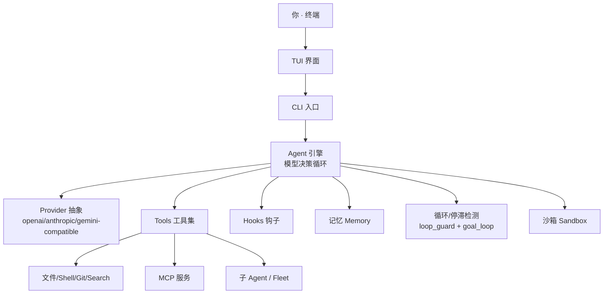

# mimofan 使用手册（Personal Workspace User Guide）

> **mimofan**（米谋）是一个跑在终端里的 AI 编程搭档：你用自然语言下指令，它调用大模型思考，再用工具（读文件、改代码、跑命令）把活干完，工作流是「模型决策 → 工具执行 → 结果回灌 → 再决策」的闭环。
>
> 本手册面向需要深度使用 mimofan、管理多模型/多会话/多工作区、理解其安全模型的工程师。想先 5 分钟上手，请看 [快速上手指南](quickstart-guide.md)。

---

## 🚀 1. 快速启动与访问

```bash
# 编译安装
cargo install --path crates/tui --locked

# 全屏 TUI 交互
mimofan

# 单次非交互调用
mimofan exec "帮我写一个正则表达式匹配邮箱"
mimofan exec --auto --output-format stream-json "修复失败测试"

# 环境自查
mimofan doctor
mimofan doctor --json
```

**核心 CLI 约定**：

- `mimofan`（无子命令）→ 全屏 TUI。
- `mimofan exec "..."` → 单次调用，不进 TUI。
- `mimofan doctor` → 自动诊断环境与配置。

全局 flag：`--config <PATH>`、`--profile <NAME>`、`--workspace <DIR>`、`-r/--resume <ID>`、`-c/--continue`、`--model <MODEL>`、`--yolo`、`--max-subagents`、`-p/--prompt`、`-v/--verbose` 等。

---

## 🧭 2. 核心架构

mimofan 是**本地优先**的终端 Agent，架构分四层：



- **Provider**：三种线协议（`openai-compatible` / `anthropic-compatible` / `gemini-compatible`）抽象不同模型网关。
- **Tools**：数十个原生工具（文件/Shell/Search/Git/Browser/MCP/子 agent 等），供模型调用。
- **Hooks**：生命周期钩子（如 `tool_call_before` / `turn_end`），可回调外部脚本。
- **守卫**：`loop_guard` 检测重复/振荡/无进展三种病态并注入提示；`goal_loop` 把一次性 `/goal` 变成持久工作循环（默认最多 50 次连续）。
- **沙箱**：命令执行隔离，支持 Landlock / Seatbelt(macOS) / bwrap / 远程 OpenSandbox 后端。

---

## ⚙️ 3. 配置体系

### 3.1 配置文件位置

| 路径 | 作用 |
|------|------|
| `~/.mimofan/config.toml` | 主配置（TOML） |
| `~/.mimofan/permissions.toml` | 工具 ask 权限规则 |
| `$WORKSPACE/.mimofan/config.toml` | 项目级覆盖（只能收紧，不能放宽） |
| `~/.mimofan/mcp.json` | MCP 服务配置 |
| `~/.mimofan/memory.md` | 单文件记忆（可选开启） |
| `~/.mimofan/memory/` | 分类目录记忆（MEMORY.md 索引） |
| `~/.mimofan/sessions/` | 会话状态 |

路径可用 `--config <PATH>` 或环境变量 `MIMOFAN_CONFIG_PATH` / `MIMOFAN_HOME` 覆盖。

### 3.2 核心配置项

```toml
provider = "openai-compatible"      # 仅三种：openai/anthropic/gemini-compatible
api_key = "YOUR_API_KEY"
base_url = "https://api.deepseek.com/v1"
default_text_model = "deepseek-v4-pro"
reasoning_effort = "max"            # off | low | medium | high | max
allow_shell = true                  # 默认 false
approval_policy = "on-request"      # on-request | untrusted | never
sandbox_mode = "workspace-write"    # read-only | workspace-write | danger-full-access | external-sandbox
max_subagents = 10                  # 1-20

[memory]
enabled = true

[search]
provider = "duckduckgo"             # duckduckgo | bing | tavily | bocha | metaso | searxng | baidu

[features]
shell_tool = true
subagents = true
web_search = true
mcp = true

[retry]
enabled = true
max_retries = 3

[update]
check_for_updates = true
```

### 3.3 多环境 Profile

用 `[profiles.xxx]` 管理多套环境，用 `mimofan --profile <name>` 或 `MIMOFAN_PROFILE=<name>` 切换：

```toml
[profiles.mimo]
provider = "xiaomi-mimo"
api_key = "YOUR_XIAOMI_KEY"
default_text_model = "mimo-v2.5-pro"

[profiles.deepseek]
provider = "custom"
api_key = "YOUR_DEEPSEEK_API_KEY"
default_text_model = "deepseek-v4-pro"
```

> 更多配置项见 `config/config.example.toml`（含完整注释）与 [docs/CONFIGURATION.md](../CONFIGURATION.md)。

---

## 💬 4. 会话与记忆

### 4.1 会话（Session）

mimofan 会话是「一次人机协作」的上下文单元，状态存在 `~/.mimofan/sessions/`。

```bash
mimofan sessions                     # 列出所有会话
mimofan resume <ID>|--last           # 恢复某个会话
mimofan fork <ID>|--last             # 从某会话分叉出新会话
mimofan exec --resume <ID> "继续干"  # 单次模式下延续会话
mimofan session attach               # 附加到运行中的会话
```

> 会话是「工作区维度」的：每个项目（`--workspace <DIR>`）有自己独立的会话与项目级状态，互不串扰。

### 4.2 记忆（Memory）

三套记忆实现并存，按需开启：

- **单文件记忆**：`~/.mimofan/memory.md`，`[memory] enabled = true` 开启，作为系统提示注入给模型。
- **分类目录记忆**：`~/.mimofan/memory/`，含 `MEMORY.md` 索引 + `user.md` / `feedback.md` / `project.md` / `reference.md` 分主题记忆。
- **向量记忆**：跨会话语义召回，需 `MIMOFAN_MEMORY_API_KEY`，未配置时优雅降级禁用。

TUI 内用 `/memory` 管理记忆。

### 4.3 上下文管理

| 指令 | 说明 |
|------|------|
| `/compact` | 压缩上下文，可附带压缩指令 |
| `/context` | 查看上下文用量分布 |
| `/purge` | 由 Agent 外科式清理上下文 |
| `/tokens` | 查看 token 统计 |

```bash
/compact 重点保留认证重构的决策，测试调试过程可以省略
```

> 想每次都强调同样的压缩重点？写进项目根目录 `AGENTS.md` 的 `# Compact Instructions` 小节即可。

---

## 🛠️ 5. 常用斜杠指令

| 类别 | 指令 |
|------|------|
| 基础 | `/help` `/clear` `/exit` |
| 模型 | `/model deepseek-chat` `/provider custom` |
| 模式 | `/plan` `/auto` `/yolo` `/fast` `/normal` |
| 代码管理 | `/freeze 只修复登录 bug` `/unfreeze` `/stash` `/anchor` |
| 任务 | `/monitor create fix-bug --issues 123,456` `/subagents` `/fleet` |
| 上下文 | `/compact` `/context` `/purge` `/tokens` |
| 其他 | `/translate` `/voice` `/hooks` `/memory` |

### 5.1 Spec Freeze（计划冻结）

防止 Agent 偏离既定计划：

```text
> /freeze 只修复登录页面的 bug，不要改动其他模块
# Agent 将严格在冻结的范围内工作，任何越界操作都需要你确认
```

### 5.2 Issue Monitor

监控 GitHub Issue 并自动关联 PR：

```text
> /monitor create fix-auth --issues 123,456 --repo owner/repo
```

---

## 🧩 6. 子 Agent 与 Fleet

### 6.1 子 Agent（Sub-agents）

并行处理复杂任务，每个子 agent 在独立上下文中工作：

```text
> 帮我同时重构 auth 模块和 database 模块
# AI 会启动多个子智能体并行工作
```

控制并发的配置：`max_subagents`（默认 8，硬上限 60）、`launch_concurrency`、`max_admitted_subagents`。详见 [docs/SUBAGENTS.md](../SUBAGENTS.md)。

### 6.2 Fleet（Agent 舰队）

`/fleet` 管理多 agent 舰队，含信任级别与角色注册表：

```toml
[fleet]
default_trust_level = "sandbox"
require_identity_verification = true
max_trust_level = "operator"
```

---

## 🔌 7. 扩展：MCP 与 Hooks

### 7.1 MCP（Model Context Protocol）

mimofan 支持 MCP 服务，配置在 `~/.mimofan/mcp.json`。详见 [docs/MCP.md](../MCP.md)。

### 7.2 Hooks（钩子）

在工具调用、任务结束等生命周期自动执行 Shell 脚本：

```toml
[hooks]
enabled = true
```

---

## 🛡️ 8. 安全与不可逆操作保护

mimofan 坚持 **Human-in-the-Loop**：每次危险操作先预览、再确认、最后回执。

- **三层审批策略**：`on-request`（默认，危险操作弹窗确认）/ `untrusted` / `never`（YOLO 全自动）。
- **沙箱四级**：`read-only` → `workspace-write`（默认）→ `danger-full-access` → `external-sandbox`（远程）。
- **项目级只允许收紧**：`$WORKSPACE/.mimofan/config.toml` 只能收紧 approval_policy / sandbox_mode，不能放宽，防止项目被越权放开。
- **权限规则独立**：ask 规则在 `permissions.toml`，支持 `auto_allow` 白名单命令前缀。
- **网络策略**：`[network]` 可控制工具外网请求权限并记录审计日志。
- **成本上限**：`[cost_budget]` 可设单会话/单日成本水位，超限只告警不阻断。

> 生产环境建议组合：`sandbox_mode = "workspace-write"` + `approval_policy = "on-request"` + 保留 `permissions.toml` 白名单。

---

## 📚 相关文档

- [快速上手指南](quickstart-guide.md) — 5 分钟上手
- [docs/CONFIGURATION.md](../CONFIGURATION.md) — 配置详解
- [docs/MODES.md](../MODES.md) — 操作模式
- [docs/SUBAGENTS.md](../SUBAGENTS.md) — 子 Agent
- [docs/MCP.md](../MCP.md) — MCP 扩展
- [ARCHITECTURE.md](../ARCHITECTURE.md) — 系统架构
